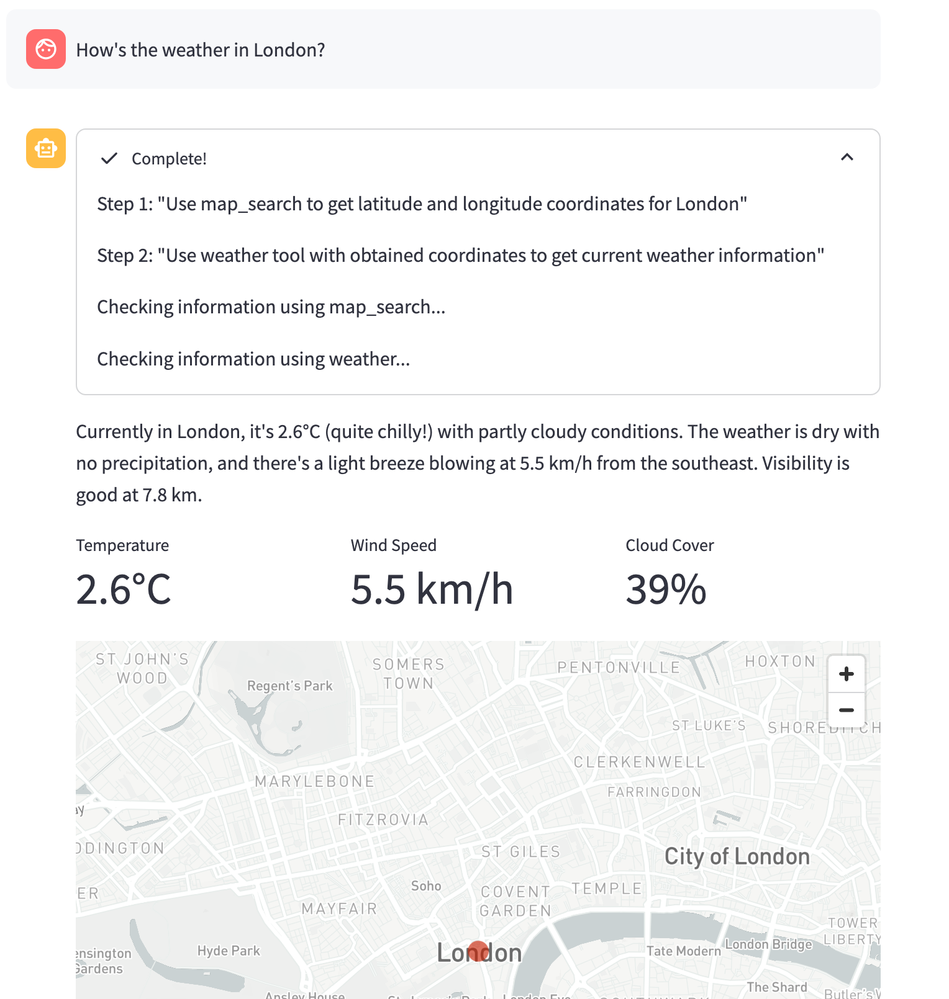
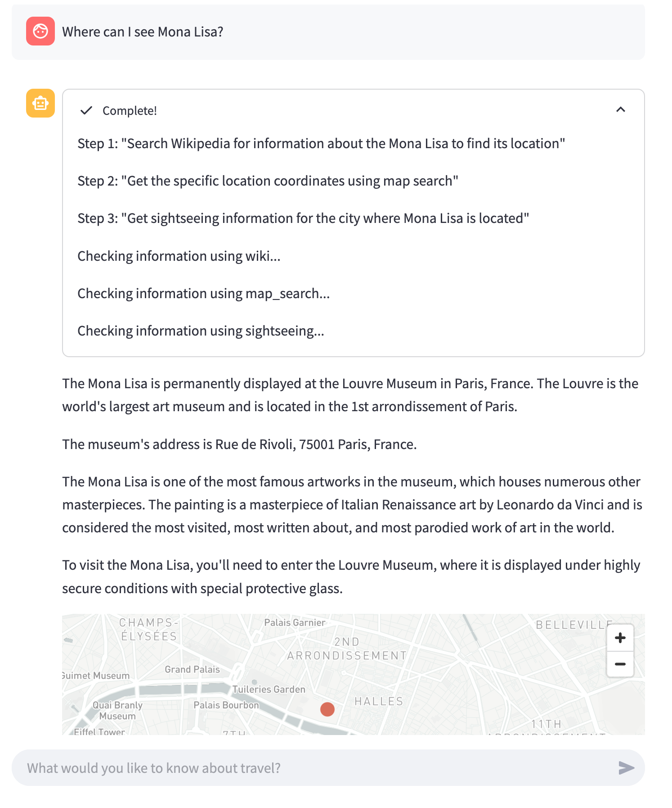

# NanoEngineer
This projects is divided into two parts:

1. **NanoEngineer**: The NanoEngineer is a script which creates a LLM chat
which plans the use and execution of tools and widgets. It is independent
of a specific LLM.
2. **Streamlit**: This is the project that contains the Streamlit application.
It comes with with a simple chat interface, two sample widgets and some tools.

## Streamlit Application
To run the streamlit application, install the dependencies:
```
pip install -r requirements.txt
```

Set the following environment variables:

```
LANGUAGE_PROVIDER=anthropic
LANGUAGE_MODEL=claude-3-5-sonnet-latest
ANTHROPIC_API_KEY="your_anthropic_api_key"
```
Then run the following command to start the streamlit application:
```
streamlit run streamlit.py
```
Question which might be asked:
- How is the weather in London?
- What can I do in London?
- What is the Mona Lisa? Where can I see it?
- What hotels are there in New York?

The tools are partially mocked, such as the sightseeing or hotel tool.
Other tools, such as the map search or weather tool, use APIs.

### Screenshots




## NanoEngineer

The NanoEngineer is a script which creates a LLM chat
which plans the use and execution of tools and widgets. It is independent
of a specific LLM.

To use the NanoEngineer, import the NanoEngineer class and create an instance:
```python
from nanoengineer import NanoEngineer, LLMInteract

llm_interact = LLMInteract(provider="anthropic", model="claude-3-5-sonnet-latest", api_key="your_anthropic_api_key")
engineer = NanoEngineer(llm_interact)
```
To register a tool, use the `register_tools` method:
```python
engineer.register_tools([
    WeatherTool,
    MapTool,
    HotelTool,
    SightseeingTool
])
```
To register a widget, use the `register_widgets` method:
```python
engineer.register_widgets([
    MetricWidget,
    MapWidget
])
```
You can create new tools and widgets by subclassing the Tool or Widget classes.
```python
from tools import Tool


class NewTool(Tool):
    name = "new_tool"
    description = "Searches for information about a topic"
    params = {
        "query": {
            "description":  "Search term to look up",
            "type": "string", 
            "optional": "no"
        }
    }
    return_schema = {
        "type": "json",
        "columns": ["result", "source"]
    }

    def execute(self, params):
        query = params.get("query")
        return {"result": "Mock result", "source": "Mock source"}
```
Any tool requires the `execute` method to be implemented, it is 
called when the NanoEngineer deems it necessary to use the tool.
It's output is returned to the LLM as a string.

The chat is executed by sending a message to the NanoEngineer:
```python
engineer.send_message("What is the weather in London?")
```
The messages can be accessed either by either by engineer.llm.history
or by letting the engineer yield the messages:
```python
for message in engineer.send_message("What is the weather in London?", yield_messages=True):
    print(message)
```
### Messages
The NanoEngineer is asked to provide specific formats for the messages,
which can be used to display specific interactions.
- `<Plan id=0><0>Use tool map_search to...</Plan>`: A plan is a list of steps which the NanoEngineer will execute to answer the user's question.
The plan may change dynamically, if the plan is not successful (e.g. the tool fails to execute) or if the user asks for a different answer.
- `<Execute plan=0 step=0>{"execute_tool": "map_search", "params": {"query": "London"}}`: The execute tag is used to indicate that a tool should be executed. The parameters are provided as a JSON object. Plan and step are used to indicate which step of the plan is being executed.
- `<Ask plan=0 step=0>Please provide a query</Ask>`: An ask is a question to the user.
- `<Answer plan=0>The weather in London is 10 degrees Celsius</Answer>`: An answer is a response to the user.
- `<Widget plan=0 name="map">{"url": "https://www.google.com/maps/place/London"}</Widget>`: A widget is a JSON object, which can be used to display information by a frontend, i.e. the streamlit map widget.

The LLM might generate tokens outside of these tags.
These are most likeley thoughts and should not be displayed to the user.
## Known issues
- The `<Answer>` is rendered on second runs, but shouldn't be.
- New messages make widgets and plansdisappear.